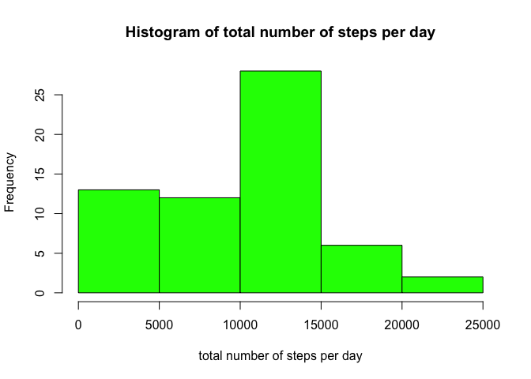
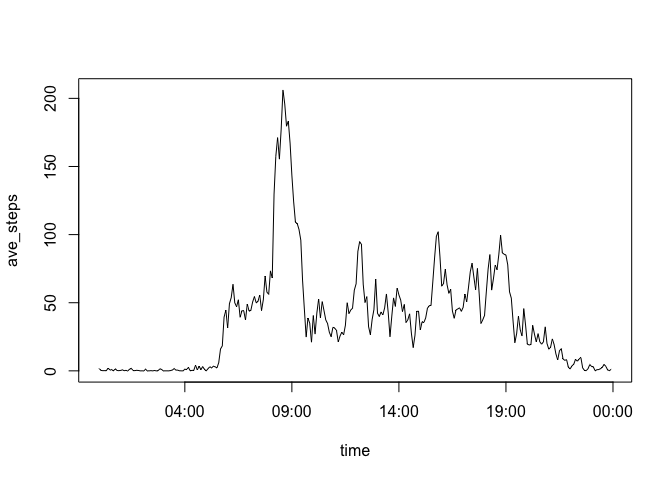
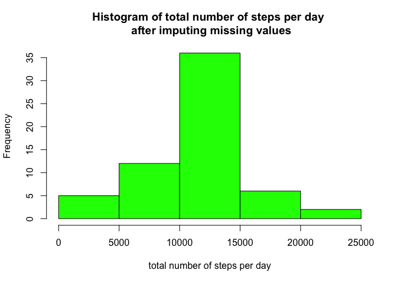
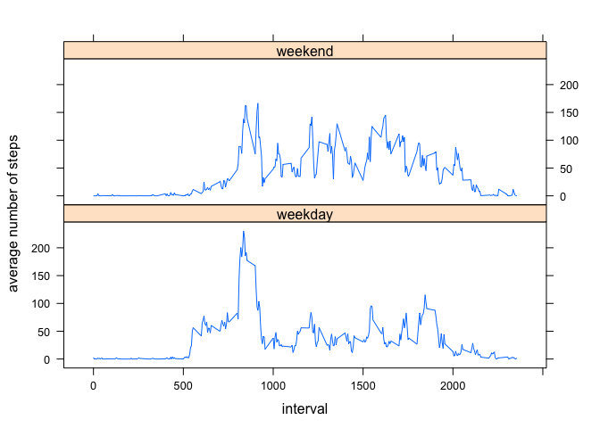

# Reproducible Research: Peer Assessment 1

## Loading and preprocessing the data

```r
data<-read.csv('activity.csv',colClasses = c('numeric','character','numeric'))
data$date=as.Date(data$date)
```

## What is mean total number of steps taken per day?

```r
steps_per_day<-tapply(data$steps,data$date,sum,na.rm=TRUE)
steps_per_day<-data.frame(row.names = names(steps_per_day),steps_per_day=steps_per_day)
hist(steps_per_day$steps_per_day,col='green',xlab = "total number of steps per day",main = "Histogram of total number of steps per day")
```

<!-- -->

```r
steps_per_day_mean<-mean(steps_per_day$steps_per_day)
steps_per_day_median<-median(steps_per_day$steps_per_day)
```
Mean and median of the total number of steps taken per day are 9354 and 10395.

## What is the average daily activity pattern?

```r
library(plyr)
ave_steps<-sapply(split(data$steps,sprintf("%04d",data$interval)),mean,na.rm=T)
ave_steps<-data.frame(time=strptime(names(ave_steps),"%H%M"),ave_steps=ave_steps)
plot(ave_steps,type='l')
```

<!-- -->

```r
time_interval_of_max_steps<-format(arrange(ave_steps,desc(ave_steps))[1,'time'],"%H:%M")
```
The time interval with average maximum number of steps is 08:35.

## Imputing missing values
The total number of rows with missing values is 2304.
 I am using the average steps across all days to fill in missing values.

```r
# create a new dataset to filling NA
data_fill_NA<-data
# preparing for merging keys
data_fill_NA$merge_key<-as.POSIXct(strptime(sprintf("%04d",data_fill_NA$interval),"%H%M"))
# the datatype of strptime is not sortable or usable as a join index, so casting that using as.POSIXct worked.
ave_steps$time=as.POSIXct(ave_steps$time)
data_fill_NA$order<-1:nrow(data_fill_NA)
data_fill_NA<-merge(data_fill_NA,ave_steps,by.x = "merge_key",by.y = "time",all.x=TRUE)
data_fill_NA[is.na(data_fill_NA$steps),"steps"]=data_fill_NA[is.na(data_fill_NA$steps),"ave_steps"]
data_fill_NA<-arrange(data_fill_NA,order) 
data_fill_NA<-data_fill_NA[,c("steps","date","interval")]


steps_per_day<-tapply(data_fill_NA$steps,data_fill_NA$date,sum,na.rm=TRUE)
steps_per_day<-data.frame(row.names = names(steps_per_day),steps_per_day=steps_per_day)
hist(steps_per_day$steps_per_day,col='green',xlab = "total number of steps per day",main = "Histogram of total number of steps per day \n after imputing missing values")
```

<!-- -->

```r
steps_per_day_mean<-mean(steps_per_day$steps_per_day)
steps_per_day_median<-median(steps_per_day$steps_per_day)
```
Mean and median of the total number of steps taken per day are 10766 and 10766.

## Are there differences in activity patterns between weekdays and weekends?

```r
is_weekend<-weekdays(data_fill_NA$date) %in% c("Saturday","Sunday")
weekday_factor<-factor(c("weekday","weekend"))
data_fill_NA$weekday<-weekday_factor[1]
data_fill_NA[is_weekend,"weekday"]<-weekday_factor[2]

detach(package:plyr)
library(dplyr)
```

```
## 
## Attaching package: 'dplyr'
```

```
## The following objects are masked from 'package:stats':
## 
##     filter, lag
```

```
## The following objects are masked from 'package:base':
## 
##     intersect, setdiff, setequal, union
```

```r
ave_steps_weekday<-data_fill_NA%>%group_by_(.dots=c("weekday","interval"))%>%summarize(ave=mean(steps))

library(lattice)
xyplot(ave~interval|weekday, data=ave_steps_weekday,type="l",layout=c(1,2),ylab = "average number of steps")
```

<!-- -->

